# Bitacora P1 - L1

## Enunciado: 

Usted está trabajando en una empresa proveedora de servicios y recibe la solicitud de
un cliente que sea tener un servidor para la implantación de un comercio electrónico
mediante un CMS.  

Sin tener más detalles por parte del cliente, le pregunta a un compañero qué configuración
se suele aplicar en estos casos. Este le remite a su jefa de Dpto. que le recomienda la
configuración de un RAID1 gestionado con LVM, cifrando toda la información para cumplir con la legislación vigente. También le recomienda crear al menos 3 VL (hogar, raiz y swap) y una partición para el arranque.  

Nota: El usuario que crearemos debe ser su primer nombre de pila acompañado de las
iniciales de sus apellidos en mayúscula. Por ejemplo, Jose Manuel Fernan Pese ->JoseFP  

## Memoria

### Introducción y conceptos

Lo primero que se debe hacer al realizar este ejercicio es leer y entender el enunciado propuesto para crear un diseño adecuado para el sistema que se implementará.

Los conceptos a tener en cuenta son la recomendación de implementar un RAID1 gestionado con LVM, cifrando la información y creando al menos 3 volúmenes lógicos (LV) y una partición para el arranque.

El término RAID, cuyas siglas significan "redundant array of independent disks" es una tecnología de virtualización del almacenamiento, en el que varios dispositivos de almacenamiento físico se "virtualizan" en una unidad lógica, con el fin de crear redundancia de datos. El RAID1 consiste en copiar los datos exactamente iguales en dos o más discos. Existen dos formas de implementar la tecnología RAID: software y hardware. La primera (la que se usa en este caso), la gestiona el SO. Es una solución barata y flexible, aunque añade carga a la CPU. La implementación por hardware necesita de una tarjeta RAID, y el SO ve un único dispositivo lógico.

La gestión con LVM se refiere a Logical Volume Manager, que añade una capa de abstracción sobre el RAID que permite crear y redimensionar volúmenes (LV) con flexibilidad. Además, es una herramienta muy útil para crear snapshots. En este caso, el LVM irá cifrado. 

### Diseño

Teniendo en cuenta los conceptos anteriores se puede proponer un diseño para el sistema con las siguientes características:  

- Se tendrán dos discos físicos (sda y sdb) sobre el que se montará el RAID1
- Cada disco se particionará en tres:
	- 1a: para el sector de arranque (GRUB) de 1MB
	- 2a: para el /boot, de aproximadamente 400MB. Se elige este tamaño porque, dependiendo de los módulos, una imagen del kernel puede llegar hasta los 200MB (de forma orientativa), para dar pie a actualizaciones, se escoge darle como mínimo el doble del máximo.
	- 3a: el resto del almacenamiento (unos 9.5GB) se usará para implementar el resto del sistema, que se gestionará con un LVM, con los 3 LV /, /home y /swap. Además, como se indica en el enunciado, el LVM irá cifrado.  

De forma esquemática, el diseño queda de esta forma:  

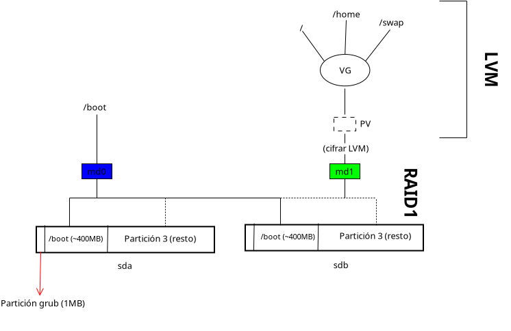

### Implementación del sistema

Se usará VirtualBox para simular el sistema y Debian como sistema operativo. El primer paso tras descargar la ISO del SO será crear una nueva máquina virtual en el programa con las siguientes características:  

- 2GB de RAM (con 500MB sería suficiente)
- 1 procesador
- 10GB de almacenamiento

Una vez creada la máquina, antes de encenderla, se procede a su configuración. En el apartado de almacenamiento, y para seguir con la filosofía RAID1, se crea un nuevo disco de 10GB (en el caso de ser de más capacidad, la capacidad total del RAID seguiría siendo 10GB). En este punto ya se tienen ambos discos propuestos en el diseño: sda y sdb.  

Ahora, convendría configurar la red. Para ello, desde VBox Archivo -> Herramientas -> Red (o bien, ctrl + h), se crea una red solo anfitrión con un nombre arbitrario (en este caso en particular vboxnet0). Volviendo ahora a la configuración de la máquina, en el apartado de Red, se añade un adaptador nuevo conectando a "Adaptador solo anfitrión".

| 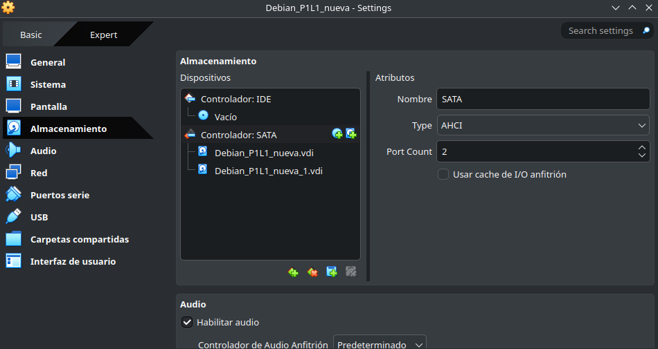 | 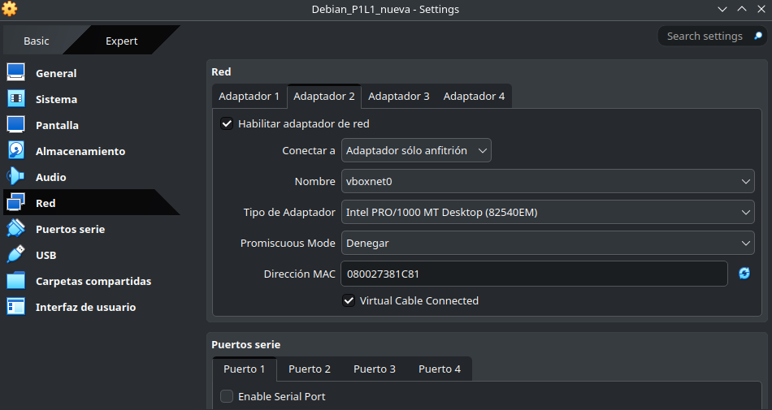 |
|----------------------|----------------------|

Posteriormente, la máquina podrá ser arrancada. Se puede seleccionar la instalación gráfica y la normal. Esta última será la elegida en este caso. Primero, se seleccionan los parámetros básicos: nombre de la máquina, contraseña del superusuario (practicas,ISE), nombre de usuario y configuración de red. 

| 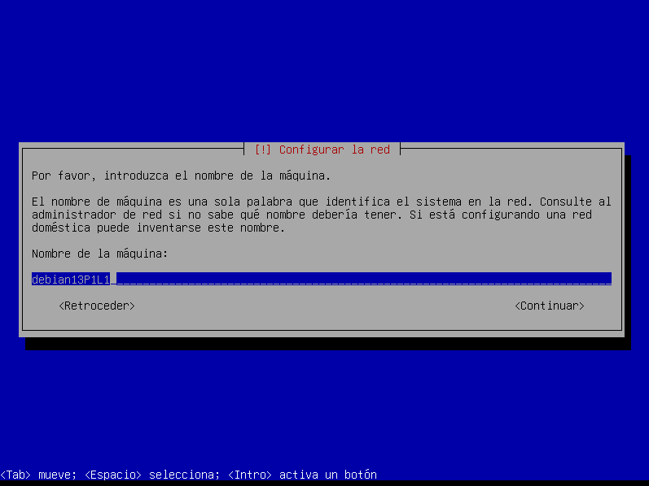 | 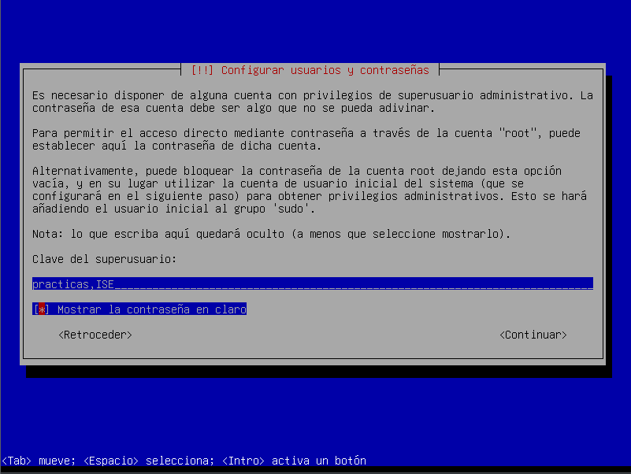 |
|----------------------|----------------------|

A la hora de llegar al apartado de particionado de discos, se accede a la configuración manual, para aplicar las particiones que requiere el diseño. Inmediatamente después, se seleccionan ambos discos disponibles (sda y sdb) y se crea una tabla de particiones.

| 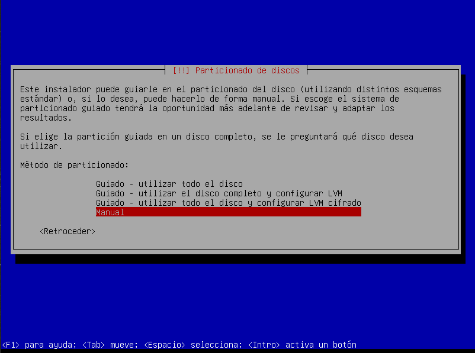 | 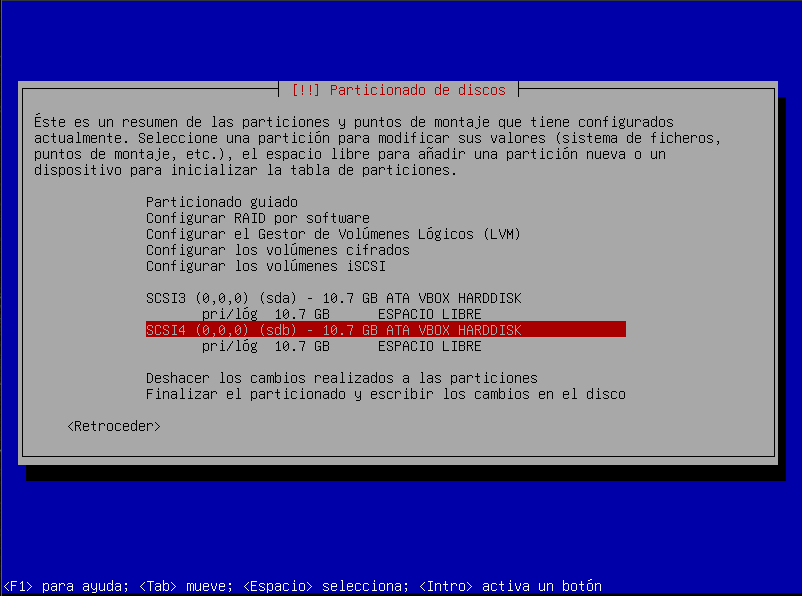 |
|----------------------|----------------------|

Para aplicar el diseño en orden ascendente, primero se crea la partición para /boot en cada uno de los discos (en la foto inferior se muestra solo en sda, pero debe hacerse en ambos). La partición será primaria, tendrá un tamaño de 400MB y en el apartado "Utilizar como" se selecciona "no utilizar", aún no será necesario. La marca de arranque si puede ser ya activada.

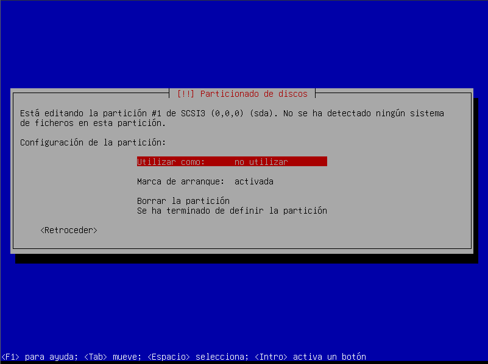

Una vez hecho esto, se puede pasar a configurar el RAID1 para el /boot. Para ello se selecciona la opción de "Configurar RAID por software", y se crea con las dos particiones anteriores las de 400MB. Una vez creado, debe quedar como en la primera captura. Seleccionamos esta partición del RAID y ya se puede montar el /boot, porque no se tocará más este almacenamiento. En la última captura de esta tira, se observa que el espacio libre que se tenía (10.3GB) se ha configurado como una partición primaria, que ocupa todo el espacio disponible y que de nuevo, se ha seleccionado "no utilizar"

| 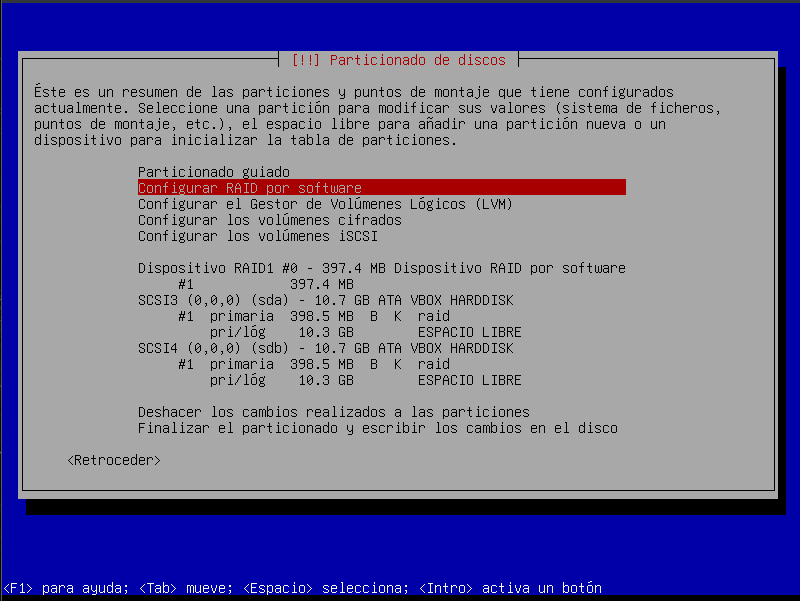 | 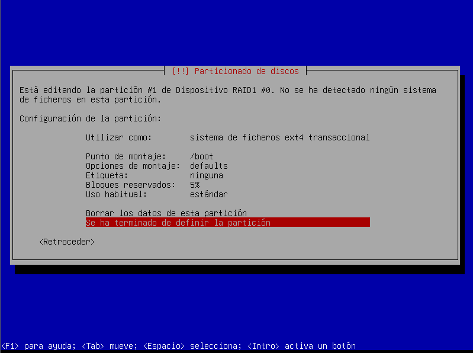 | 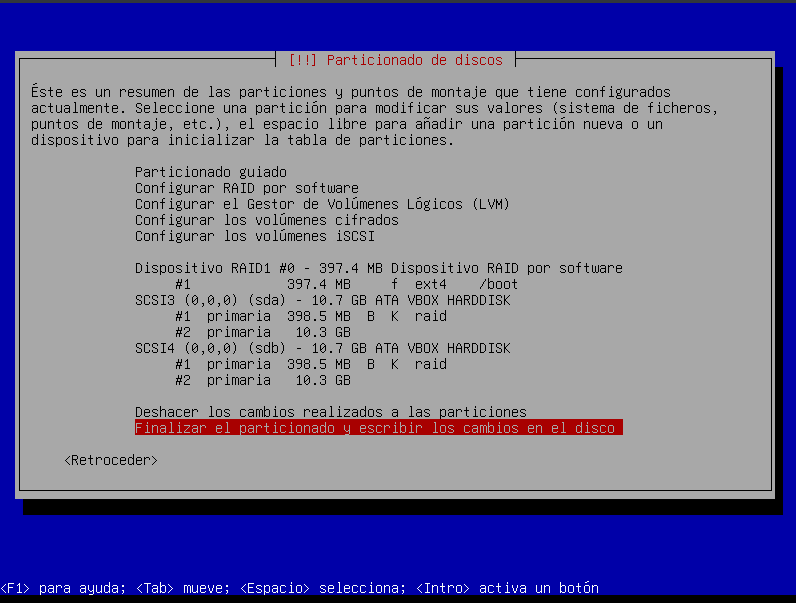 |
|----------------------|----------------------|----------------------|

Continuando con el diseño, las dos particiones disponibles se configuran en otro RAID1.

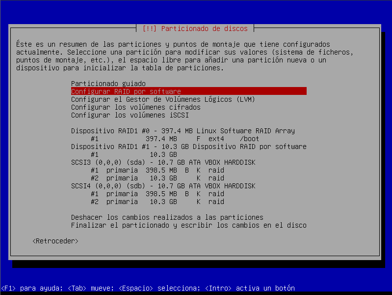

Posteriormente, se abre el gestor de Volúmenes Lógicos (LVM) y se crean md0 y md1, el primero con /boot y el otro con el espacio libre en el RAID que se creó anteriormente. Se cifra el md1, siguiendo con el diseño. Se puede ver el resultado en la segunda captura.

| 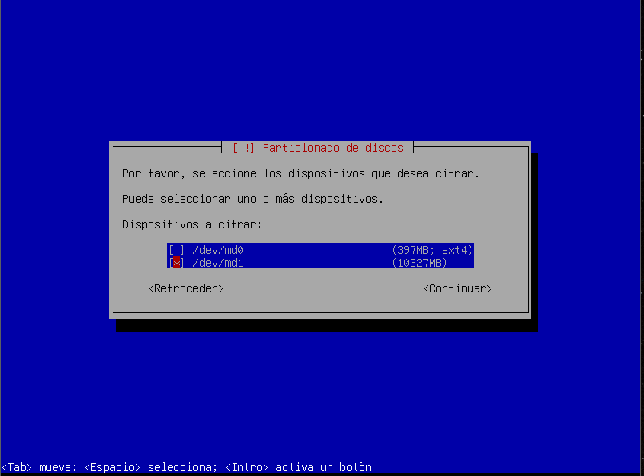 | 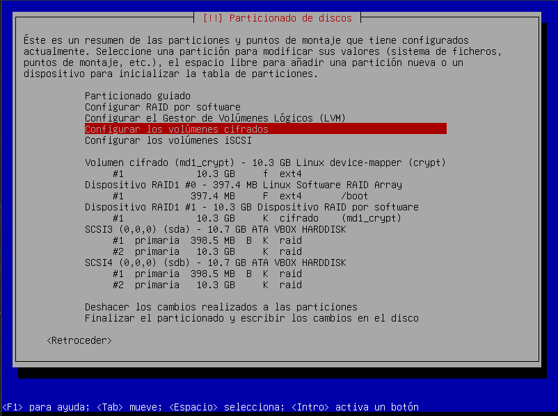 |
|----------------------|----------------------|

Finalmente, para terminar con el diseño, dentro del LVM cifrado, se crean los LV que se indican en el enunciado: /, /home y /swap (área de intercambio). Primero se crean y dan nombre y luego se montan correctamente.

| 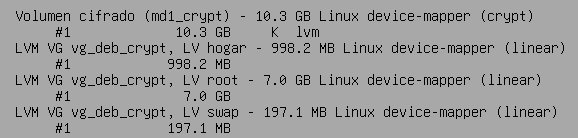 | 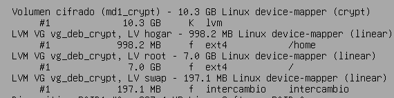 |
|----------------------|----------------------|

