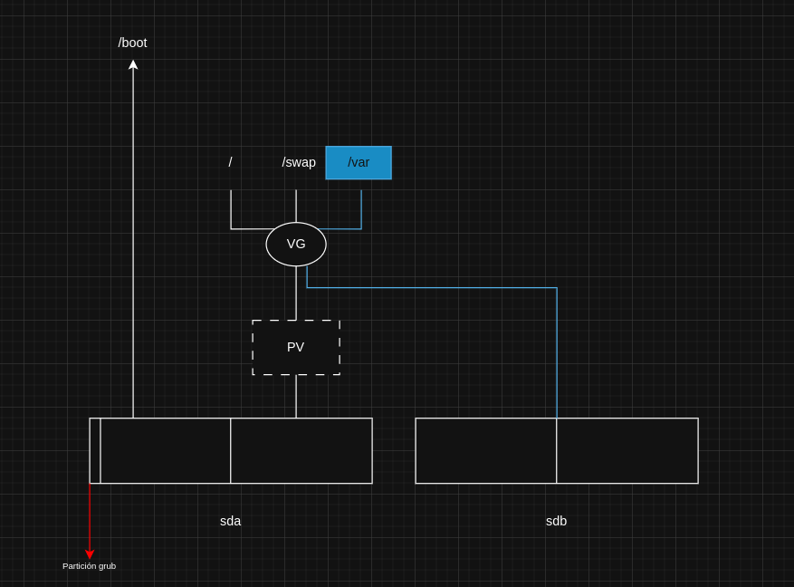
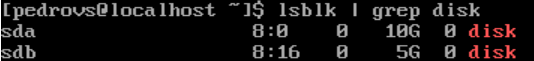
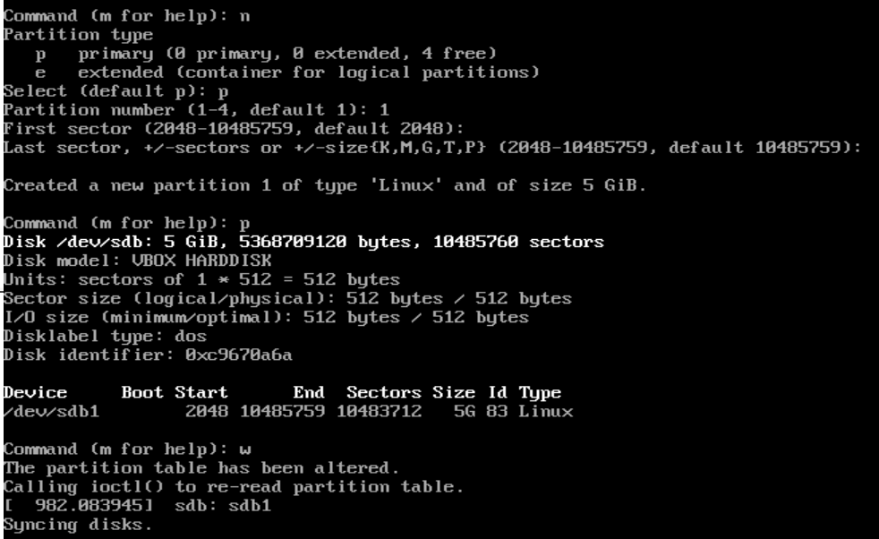
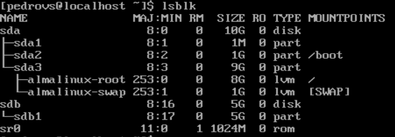
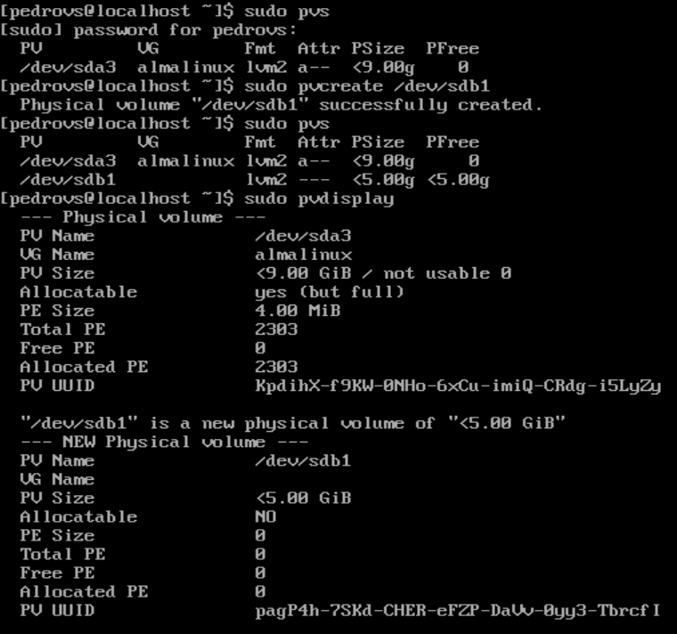
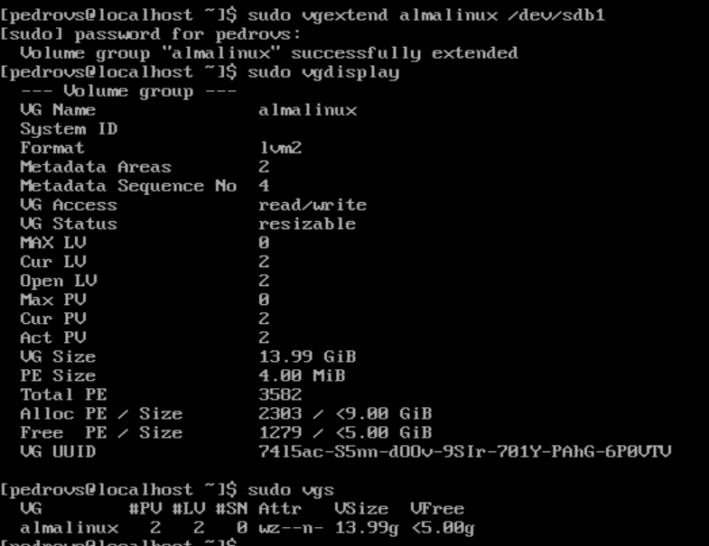
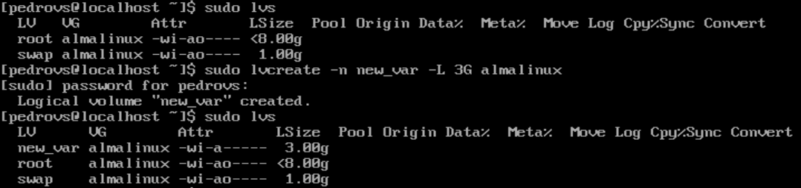
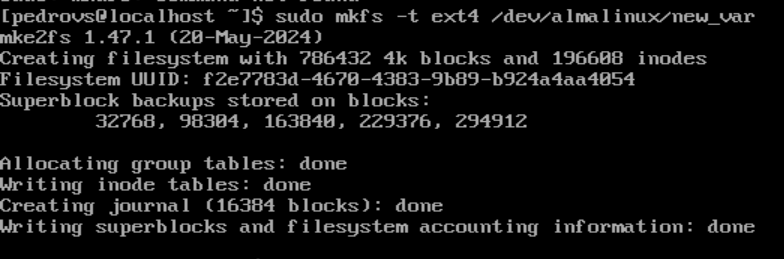

# Bitácora P1L2

## Enunciado: 

En esta ocasión, en la empresa en la que le acaban de contratar tenían adquirido un
servidor y su predecesor había realizado la instalación del S.O. Alma Linux, según le
han comentado los compañeros, él solía hacer instalaciones por defecto y luego aplicar
scripts de configuración. 

Sin más información, nuestro jefe nos informa que esa máquina
va a alojar unos cursos con vídeos de alta calidad y relativamente largos. Por tanto,
viendo la configuración del sistemas, prevemos que /var necesitará más espacio, incluso
es conveniente asignarle un LV exclusivamente. Para ello, incluiremos un nuevo disco y
configuraremos LVM para que /var se monte en el nuevo VL que crearemos para él.

## Memoria

### Introducción y conceptos

Lo primero que se debe hacer es crear una máquina virtual de AlmaLinux con su configuración por defecto.
En este caso, se le asignan 10 GB de disco a la máquina y se procede con la instalación automática, sin tocar ningún tema de almacenamiento. Eso sí, creando un root con su contraseña y un usuario. Una vez completada la instalación verificamos con el comando `lsblsk` que todo está correcto. La instalación ha creado un disco sda con 3 particiones, la primera (de 1MB) para el arranque de la BIOS, la segunda para /boot y la tercera es un PV de LVM con espacio para root y swap.

Hecho y entendido esto, se puede pasar a realizar el diseño del sistema que se quiere implementar.

### Diseño

Teniendo en cuenta lo anterior y releyendo el enunciado, un diseño apropiado para este sistema sería:

- Se tendrán dos discos físico (sda y sdb): sda se quedará con la configuración planeada en el apartado de introducción (defecto) y sdb será un disco nuevo de 10 GB en el cual se creará un PV que se le asignará al VG creado por sda con un espacio grande para /var y cumplir con el enunciado.

De forma esquemática, el diseño queda de esta forma:  



### Implementación del sistema

Lo primero que se debe hacer es agregar un disco a la máquina desde la ocnfiguración de la misma en VirtualBox, en este caso, sdb de 5G:  

  

Ahora, se debe decidir si vale la pena crear el PV usando todo el disco o si hacer una partición. Esto último sería más recomendable, para tener espacio para metadatos o para instalar grub si fuera necesario. Para hacer la partición se usa `fdisk`:  

```
man fdisk #Siempre es recomendable visitar el manual
sudo fdisk /dev/sdb #Para entrar a la configuración de sdb
```  

Dentro de fdisk, creamos la partición, usando los switches que proporciona `fdisk` (se pueden consultar con m). Se crea la partición, dejando unos 2MB para el apartado de metadatos y se comprueba que todo está correcto:

|  |  |
|----------------------|----------------------|

El siguiente paso es crear el PV a partir de la partición que se acaba de crear, sbd1:

```
man pvscreate #Siempre es recomendable visitar el manual
sudo pvcreate /dev/sdb1 #Crear el PV
sudo pvs    #Lista corta de los PV's creados
sudo pvdisplay #Lista detalleda de los PV's creados
```  



Ahora, configurado el PV, se debe extender este al VG principal, el cual en este caso se llama "almalinux". Para consultar información sobre el VG:  

```
sudo vgs
sudo vgdisplay
```

Para realizar la expansión, se usa el comando `vgextend`:  

```
man vgextend #Siempre es recomendable visitar el manual
#El uso del comando es: sudo vgextend <grupo de volumenes a extender> <volumen físico>:
sudo vgextend almalinux /dev/sdb1
sudo vgdisplay #Comprobar que todo es correcto
```



Hecho esto correctamente, se configura ahora el LV. De nuevo antes de nada, se pueden usar los comandos `lvs` y `lvdisplay` para ver de donde se parte. Para crear volúmenes lógicos se usa el comando `lvcreate`: 

```
man lvcreate #Siempre es recomendable visitar el manual
#El comando completo: sudo lvcreate -n <nombre> -L <Longitud> <VG a asignar>
sudo lvcreate -n new_var -L 3G almalinux
sudo lvdisplay #Comprobar que todo es correcto
```



Terminada esta parte, solo quedarían cuestiones de SO:  

Prev: crear un sistema de archivos para el LV creado:

Antes que nada, se debe discutir que FS le conviene mejor a /new_var. Por su estabilidad y conveniencia para el trabajo con archivos grandes, además de por ser un estándar, se elige ext4. Para la creación se usa `mkfs`con los parámetros: `sudo mkfs -t <FS> <LV donde se va a crear>:



- Acceder al LV y montarlo
- Copiar la información de /var al LV, de manera atómica
- Indicar al SO donde /var
- Liberar espacio

El primer paso es crear un punto de montaje para el LV creado y montarlo