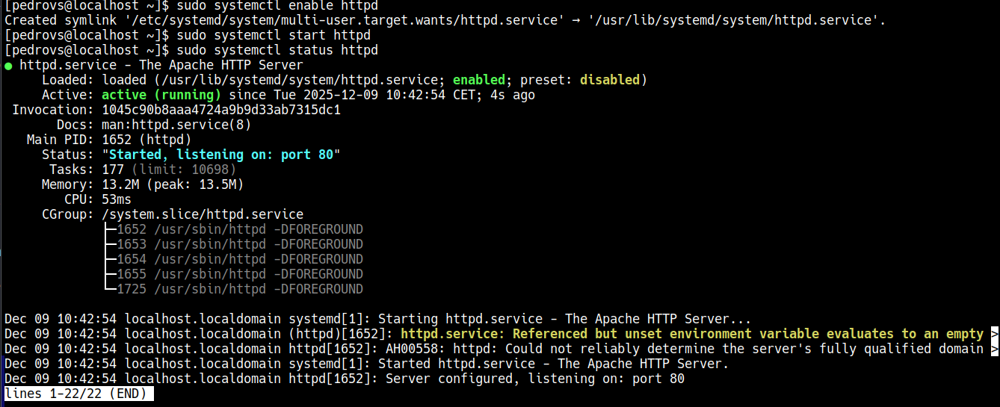
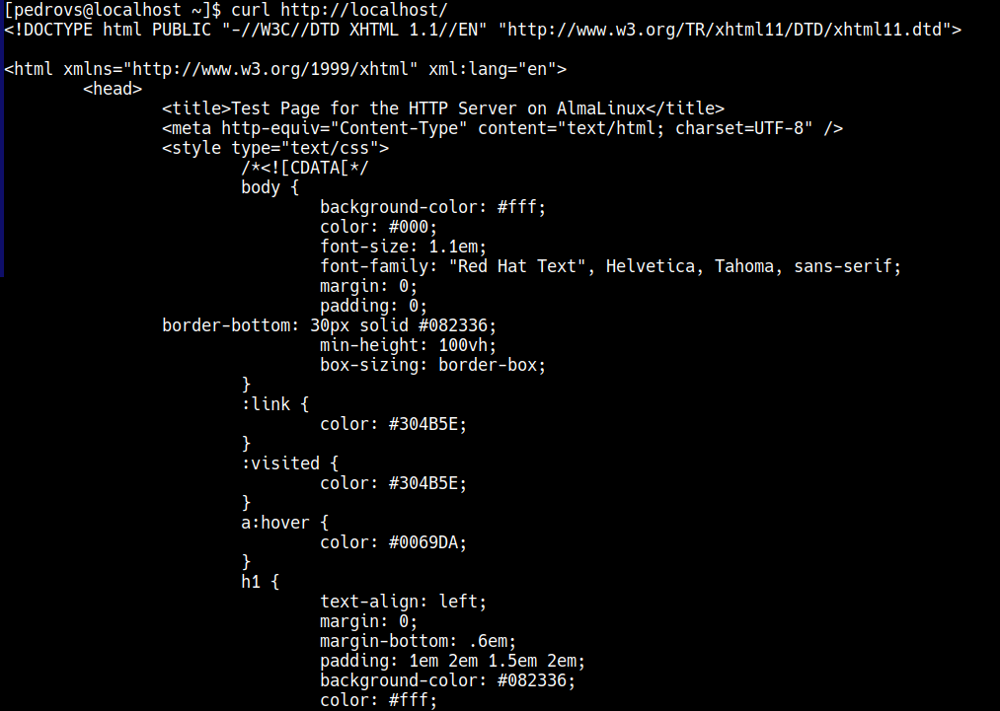

# Bitacora P2L3

## Enunciado

Recibe una nueva llamada, el equipo de desarrollo no tiene conocimiento de sistemas
y debe hacer que el servidor tenga configurado un servidor web para poder ejecutar
Wordpress así que decide instalar y configurar la pila (el stack) LAMP

## Introducción y conceptos

La pila LAMP es un conjunto de cuatro tecnologías software diferentes que se utilizan para crear y mantener sitios y aplicaciones web. Las tecnologías de la pila son de código abierto, además que es eficiente ya que es una solución probada y comprobada, entre muchas otras ventajas como la flexibilidad y el fácil mantenimiento. Las tecnologías de la pila LAMP:

- Linux: el primer nivel de la pila. El SO por excelencia
- Apache: un servidor web que almacena archivos e intercambia información con HTTP
- MariaDB: un SGBD
- PHP: es un lenguaje de scripts que permite a los sitios web ejecutar procesos dinámicos. Esto es necesario para que el servidor web, la BD y el SO procesen de manera coherente las solicitudes de los navegadores.

Todo lo anterior funciona como una máquina que es capaz de: 

- Recibir solicitudes
- Procesarlas de manera correcta
- Respuesta de devoluciones

## Diseño

Se trabajará en un entorno Linux (Almalinux) y se irán instalando y configurando los apartados de la pila de forma que se confirme la correcta instalación y funcionamiento de las mismas.

## Implementación del sistema

El primer punto en la pila es Linux, algo que se resuelve con el SO elegido. El siguiente es Apache.

Para instalarlo se usa dnf:

```
sudo dnf install httpd -y # En Debian se usaría apache2
```

Ahora, con systemctl, se activa e inicia el servicio:

```
sudo systemctl enable httpd
sudo systemctl start httpd
sudo systemctl status httpd
```



Para comprobar que funciona solo es necesario hacer un `curl` al localhost y comprobar que devuelve el HTML de la página por defecto de Apache:

```
curl http://localhost
```



