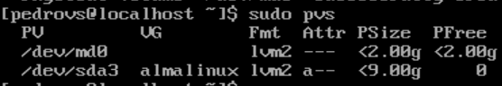
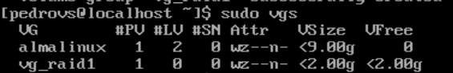
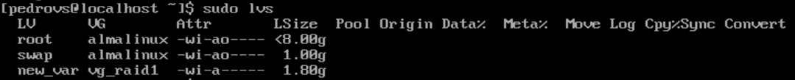

16. crypttab
        a. blkid | grep LUKS >> /etc/crypttab ; Para redirigir a tabla de encriptado ; editar prefijo /dev/mapper ; 
                Especificar UUID sin comillas ; poner none al final para especificar ninguna opción al final ; 
                vg_raid1-new_var_crypt UUID=<UUID> none <---- Así tiene que quedar 

17. mv /var /var_old ; 

18. reboot ; pedirá contraseña ; iniciar sesión ; lsblk y comprobar que el diseño es correcto

# Bitácora P1L3

## Enunciado

Tras ver el éxito de los vídeos alojados en el servidor configurado en la práctica anterior, un amigo de su cliente quiere proceder del mismo modo pero va a necesitar alojar información sensible así que le pide explícitamente que cifre la información y que ésta esté siempre disponible. Por tanto, la decisión que toma es configurar un RAID1 por software y cifrar el VL en el que /var estará alojado.

## Memoria

### Introducción y conceptos

Este escenario es similar al del ejercicio anterior. Lo que cambia es que en este caso se debe tener en cuenta que la información se debe cifrar y que siempre ha de estar disponible. Esto se refiere, como dice en la última parte del enunciado, configurar un RAID1 por software y cifrar el VL en el que la información se alojará.

Para comenzar, se crea una máquina nueva con Almalinux y la configuración por defecto

### Diseño

Teniendo en cuenta lo anterior, el diseño a implementar será similar también al del enunciado del ejercicio 2, con algunos cambios.  

El más notorio el de la implementación del RAID1. Para ello hará falta añadir dos discos físicos, sdb y sdc. 

También hay que tener en cuenta el apartado del cifrado y justificar qué cifrar. En este aspecto se tienen dos enfoques válidos:  

Prev: LUKS (Linux Unified Key Setup) es un estándar de cifrado de disco que cifra dispositivos de bloque completos.

1. LVM on LUKS: cifrado del disco completo. No interesa del todo porque al cifrar todo el disco, incluye también directorios que no vale la pena, como /bin. 
2. LUKS on LVM: el cifrado se hace directammente en /var. Lo que permite cifrar solo lo que es necesario.

Dicho esto, el diseño del sistema quedaría algo así:  

  

### Implementación del sistema

Partiendo de una instalación por defecto de Almalinux, lo primero que se comprueba es que toda la instalación y configuración de discos es correcta. Se apaga la máquina, y desde la configuración de VirtualBox se añaden los dos discos, sdb y sdc, cada uno de 2GB:  

  

Ahora, para crear la configuración RAID1 por software, se usa el comando `mdadm`, el cual no viene por defecto instalado en Almalinux. Para instalarlo, se usa `sudo dnf install mdadm` comprobando si la instalación es correcta y teniendo cuidado en la versión que se instala.  

Es recomendable consultar el manual del comando para familiarizarse con su uso.

Antes de proceder a usar el comando, se crean las particiones en sdb y sdc usando `fdisk`, de la misma forma que en el ejercicio anterior. Debería quedar una configuración así:

  

Ahora ya se puede crear el MD para el RAID1. En el manual se consulta el uso del comando y se procede de la siguiente manera:

```
mdadm --<modo> <nombre dispositivo> --level=<nivel raid> --raid-devices=<num dispositivos> <dispositivos>
sudo mdadm --create /dev/md0 --level=1 --raid-devices=2 /dev/sdb1 /dev/sdc1
```

Una vez hecho esto, se comprueba con un `ls /dev` y/o `lsblk` que todo ha ido bien. 

Ahora, a partir de md0, se crea el PV, usando `pvcreate`, de forma similar al ejercicio anterior:

```
sudo pvs
sudo pvcreate /dev/md0
sudo pvs #Comprobar que todo OK
```

  

Posteriormente, se procede a crear el VG, usando `vgcreate`:

```
sudo vgs
sudo vgcreate vg_raid1 /dev/md0
sudo vgs #Comprobar que todo OK
```

  

Lo único que falta ahora para completar el diseño (aparte del cifrado) es crear el LV, /var. Para ello se usa `lvcreate`

```
sudo lvs
sudo lvcreate -n new_var -L 1.8G vg_raid1
sudo lvcreate #Comprobar que todo OK
```

  

Para el cifrado se usa la herramienta cryptsetup, que se debe de instalar (de la misma forma que mdadm). Sería recomendable visitar la página del manual del comando. 

La sintaxis para el cifrado del LV es bastante intuitiva:  

```
sudo cryptsetup luksFormat /dev/vg_radi1/new_var #Pedirá una confirmación de reescritura y una contraseña
```

Aún no está el ejercicio acabdo, debemos acceder al volumen para activarlo:

```
sudo cryptsetup luksOpen /dev/vg_raid1/new_var vg_raid1-new_var_crypt
ls /dev/mapper #Comprobar que todo OK, debería aparecer el volumen cifrado activado
```

El trabajo que queda es igual ahora al del ejercicio anterior, crear sistema de archivos, montar el volumen lógico etc.

Como está explicado en la anterior memoria, se resume:

```
#Crear fs

sudo mkfs -t ext4 /dev/mapper/vg_raid1-new_var_crypt 

#Copiar información de manera atómica

sudo systemctl isolate rescue
systemctl status #Debe aparecer modo maintanance

mkdir /new_var
mount /dev/mapper/vg_raid1/vg_raid1-new_var_crypt /new_var

cp -a /var/. /new_var/
ls -laZ /var
ls -laZ /new_var #Comprobar que tienen los mismos archivos

#Indicar al SO donde irá /var, editando fstab

vi /etc/fstab
(dentro) /dev/mapper/vg_raid1-new_var_crypt   /var    ext4     dafaults        0 0
```

Ahora se debe indicar al SO que cuando arranque active el LV, para esto se usa el comando `crypttab`:

```
blkid | grep crypto #Filtrar los UUID de los cifrados
sudo blkid | grep crypto > /etc/crypttab #Redirigir la salida al archivo crypttab
```

Se edita el archivo para que quede de la siguiente forma, acorde con la nomenclatura:

`vg_raid1-new_var_crypt UUID=<sin comillas> none`