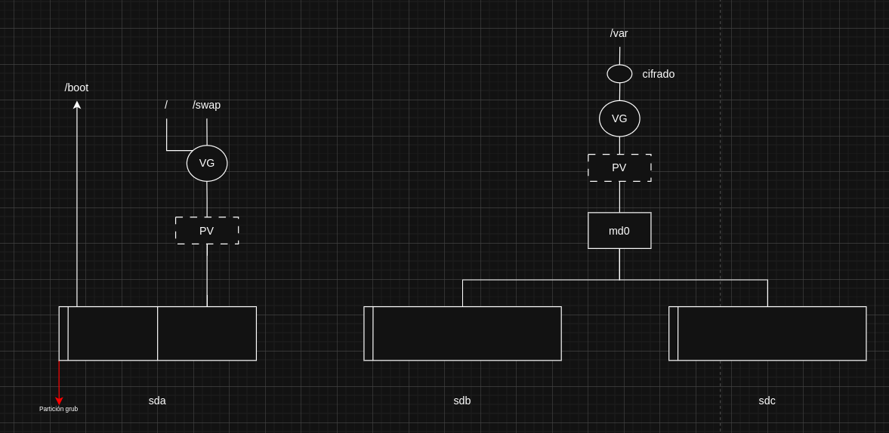
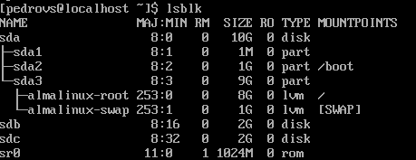
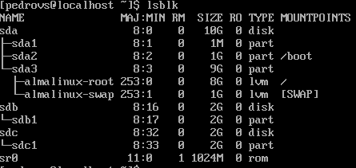

1. Crear sdb y sdc OK 

2. Formatearlos fdisk /dev/sdb y /dev/sdc

3. instalar mdadm con dnf install mdadm

4. Consultar manuan mdadm. Sirve para gestionar MultiDevices

5. mdam --create /dev/md0 --level=1 --raid-devices=2 /dev/sdb1 /dev/sdc1 para el raid1

6. Comprobar que md0 ha sido creado con lsblk

7. Crear Physical Volume : pvs ; pvcreate /dev/md0 ; pvs

8. Crear Volume Group : vgs ; vgcreate vg_raid1 /dev/md0 ; vgs

9. Crear Logical Volume : lvs ; lvcreate -L <tam 1.9GB aprox> -n new_var vg_raid1 ; lvs

10. Cifrar Logical Volume (new_var) con cryptsetup : dnf install cryptsetup ; man cryptsetup ; cryptsetup luksFormat /dev/vg_raid1/new_var 

11. Activar volumen cifrado (decirle al kernel que tiene la contraseña y el Volumen y montar el sistema de archivos)
        a. cryptsetup luksOpen /dev/vg_raid1/new_var vg_raid1-new_var_crypt
        b. Introducir contraseña
        c. Comprobar en /dev/mapper

12. Crear sistema de archivos con mkfs
        a. mkfs -t xfs /dev/mapper/vg_raid1/vg_raid1-new_var_crypt

13. Montar el Volumen Lógico con mkdir 
        a. mkdir /mnt/new_var
        b. mount /dev/mapper/vg_raid1-new_var_crypt /mnt/new_var

14. Copiar información con systemctl y cp -a
        a. systemclt isolate rescue
        b. systemclt status
        c. cp -a /var/. /mnt/new_var
        d. ls -laZ /var

15. Editar el FS anterior
        a. nano /etc/fstab
        b. /dev/mapper/vg_raid1-new_var_crypt   /var    xfs     dafaults        0 0

16. crypttab
        a. blkid | grep LUKS >> /etc/crypttab ; Para redirigir a tabla de encriptado ; editar prefijo /dev/mapper ; 
                Especificar UUID sin comillas ; poner none al final para especificar ninguna opción al final ; 
                vg_raid1-new_var_crypt UUID=<UUID> none <---- Así tiene que quedar 

17. mv /var /var_old ; 

18. reboot ; pedirá contraseña ; iniciar sesión ; lsblk y comprobar que el diseño es correcto

# Bitácora P1L3

## Enunciado

Tras ver el éxito de los vídeos alojados en el servidor configurado en la práctica anterior, un amigo de su cliente quiere proceder del mismo modo pero va a necesitar alojar información sensible así que le pide explícitamente que cifre la información y que ésta esté siempre disponible. Por tanto, la decisión que toma es configurar un RAID1 por software y cifrar el VL en el que /var estará alojado.

## Memoria

### Introducción y conceptos

Este escenario es similar al del ejercicio anterior. Lo que cambia es que en este caso se debe tener en cuenta que la información se debe cifrar y que siempre ha de estar disponible. Esto se refiere, como dice en la última parte del enunciado, configurar un RAID1 por software y cifrar el VL en el que la información se alojará.

Para comenzar, se crea una máquina nueva con Almalinux y la configuración por defecto

### Diseño

Teniendo en cuenta lo anterior, el diseño a implementar será similar también al del enunciado del ejercicio 2, con algunos cambios.  

El más notorio el de la implementación del RAID1. Para ello hará falta añadir dos discos físicos, sdb y sdc. 

También hay que tener en cuenta el apartado del cifrado y justificar qué cifrar. En este aspecto se tienen dos enfoques válidos:  

Prev: LUKS (Linux Unified Key Setup) es un estándar de cifrado de disco que cifra dispositivos de bloque completos.

1. LVM on LUKS: cifrado del disco completo. No interesa del todo porque al cifrar todo el disco, incluye también directorios que no vale la pena, como /bin. 
2. LUKS on LVM: el cifrado se hace directammente en /var. Lo que permite cifrar solo lo que es necesario.

Dicho esto, el diseño del sistema quedaría algo así:  

  

### Implementación del sistema

Partiendo de una instalación por defecto de Almalinux, lo primero que se comprueba es que toda la instalación y configuración de discos es correcta. Se apaga la máquina, y desde la configuración de VirtualBox se añaden los dos discos, sdb y sdc, cada uno de 2GB:  

  

Ahora, para crear la configuración RAID1 por software, se usa el comando `mdadm`, el cual no viene por defecto instalado en Almalinux. Para instalarlo, se usa `sudo dnf install mdadm` comprobando si la instalación es correcta y teniendo cuidado en la versión que se instala.  

Es recomendable consultar el manual del comando para familiarizarse con su uso.

Antes de proceder a usar el comando, se crean las particiones en sdb y sdc usando `fdisk`, de la misma forma que en el ejercicio anterior. Debería quedar una configuración así:

  

Ahora ya se puede crear el MD para el RAID1. En el manual se consulta el uso del comando y se procede de la siguiente manera:

`mdadm --<modo> <nombre dispositivo> --level=<nivel raid> --raid-devices=<num dispositivos> <dispositivos>`
`mdadm --create /dev/md0 --level=1 --raid-devices=2 /dev/sdb1 /dev/sdc1`
