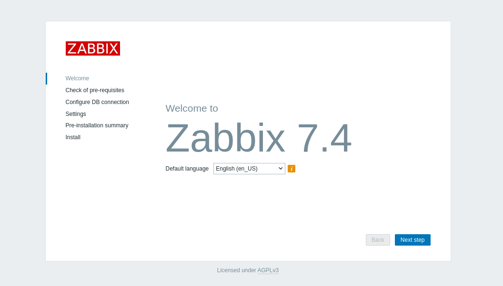
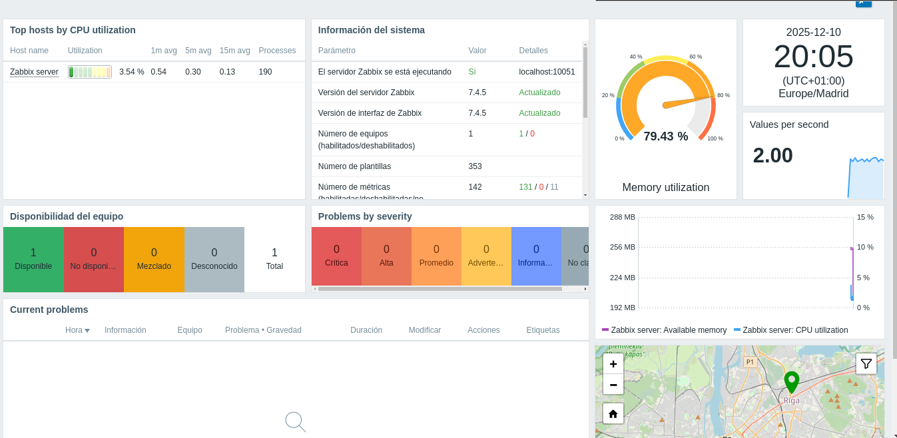
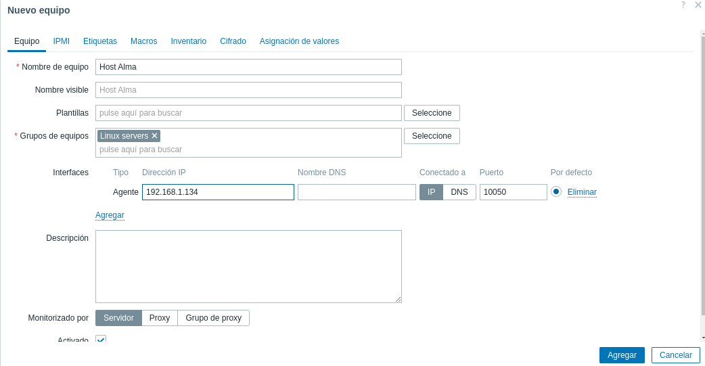
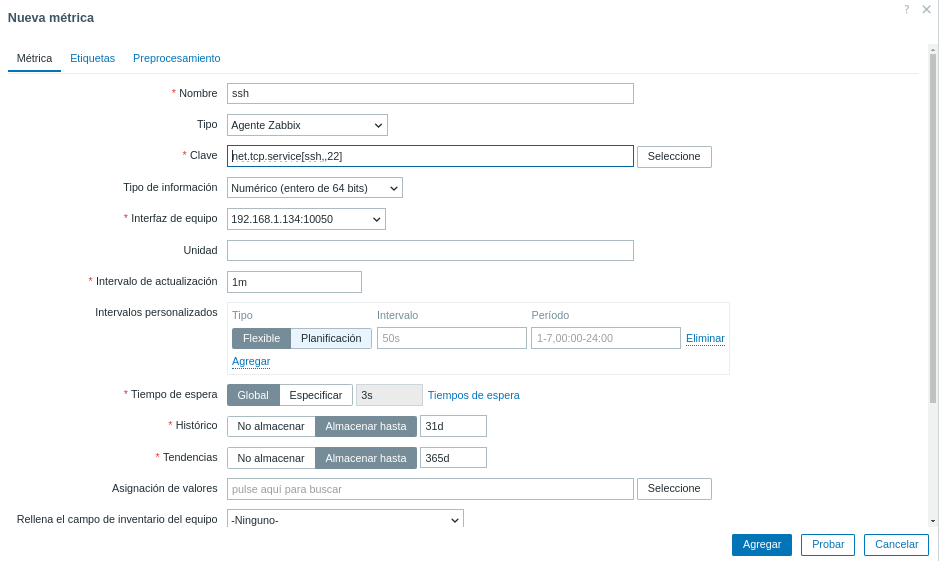
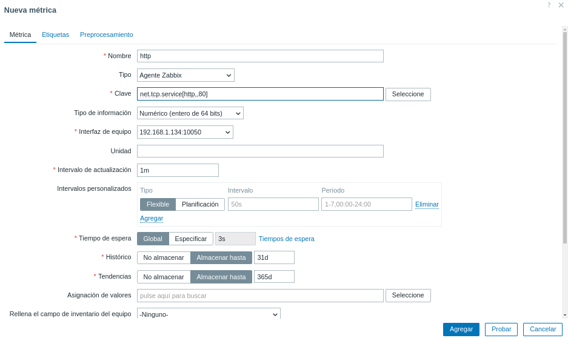

# Bitacora P3L1

## Enunciado

Realice una instalación de Zabbix 7.4 en su servidor con Debian 13 y configure para que
se monitorice a él mismo y para que monitorice a la máquina con Alma Linux.

Puede configurar varios parámetros para monitorizar, uso de CPU, memoria, etc. pero
debe configurar de manera obligatoria, como mínimo, la monitorización de los servicios
SSH y HTTP.

Es recomendable, para reforzar el aprendizaje, que documente el proceso de instalación
y configuración indicando las referencias que ha utilizado así como los problemas que ha
encontrado.

## Introducción y conceptos

Lo que se pretende en este ejercicio es configurar una máquina Debian13 como "servidor de monitorización" instalando Zabbix.

Zabbix es un programa de monitorización de código abierto, usada para supervisar el estado de la red, los servidores, las máquinas virtuales y las aplicaciones en tiempo real.

## Diseño

Lo que se pide es que Debian se monitorice a sí mismo y además a la máquina de Almalinux. Se configurará primero los parámetros obligatorios y después algunos de los opcionales. 

Se trabaja con dos máquinas virtuales con los SO's mencionados anteriormente.

## Implementación del sistema

Lo primero es configurar Zabbix en Debian, para ello, se consulta en la web que versión interesa (la última para Debian13) y se descarga usando `wget`. Además, en la página oficial proporciona informacińo exacta sobre lo que se está instalando y los comandos:

```
# Repositorio de Zabbix

wget https://repo.zabbix.com/zabbix/7.4/release/debian/pool/main/z/zabbix-release/zabbix-release_latest_7.4+debian13_all.deb
dpkg -i zabbix-release_latest_7.4+debian13_all.deb
apt update

# Servidor, frontend y agente

apt install zabbix-server-mysql zabbix-frontend-php zabbix-apache-conf zabbix-sql-scripts zabbix-agent
```

Ahora, se indica que el usuario cree una base de datos inicial. Antes hay que comprobar y tener configurado MariaDB (no se profundiza en esto ya que se ha tratado en la práctica anterior).

```sql
create database zabbix character set utf8mb4 collate utf8mb4_bin;
create user zabbix@localhost identified by 'password';
grant all privileges on zabbix.* to zabbix@localhost;
set global log_bin_trust_function_creators = 1;
quit;
```

Lo próximo que dice en la web es que se debe importar el esquema inicial y datos.

```
zcat /usr/share/zabbix/sql-scripts/mysql/server.sql.gz | mysql --default-character-set=utf8mb4 -uzabbix -p zabbix
```

Ahora se desactiva el log_bin_trust_function_creators

```sql
set global log_bin_trust_function_creators = 0;
```

Ahora, se configura una contraseña para la base de datos, editando la línea `DBPassword` del archivo `/etc/zabbix/zabbix_server.config`

Para terminar, se activa el servicio tanto de Zabbix como de Apache:

```
systemctl restart zabbix-server zabbix-agent apache2
systemctl enable zabbix-server zabbix-agent apache2
```

Finalmente, desde un navegador, se comprueba que todo es correcto haciendo `http://IP/zabbix`



Bien, ahora queda configurar el propio Zabbix. En el apartado de configuración de la BD, en la contraseña poner practica,ISE. 

Cuando se termine la configuración, se ingresa como 'Admin' con contraseña 'zabbix' y debe aparecer el siguiente panel:



Bien, ahora hay que instalar el agente en Alma. El proceso es prácticamente similar a lo explicado, eligiendo en la web Almalinux y agente. Se retoma cuando haya cambios. (Hay cambios desde el principio, pero están explicados en la web)

Con un systemctl se comprueba que el proceso está corriendo correctamente.

Se debe ahora hacer que Debian monitoree esta máquina. Para ello, se edita el fichero `/etc/zabbix/zabbix_agentd.conf`:

```bash
Server='IP del server Debian'
ServerActive='IP Almalinux'
Hostname='Nombre (opcional, defecto es Zabbix Host)'
```

Reiniciamos el servicio con systemctl.

De vuelta en la UI de Zabbix, vamos a la ventana Recopilación de datos -> Equipos -> Crear equipo



Cuando se cree el host, se debe configurar el firewall de Almalinux para poder abrir los puertos, los que interesan son el 22022, 80 (ssh y http) y 10050. Este ultimo es el de Zabbix server. Se usa el comando `firewall-cmd` como en las prácticas anteriores. Si se configuró bien en su momento, solo hará falta añadir el 80 y el 10050. Ahora Alma y Debian se conocen.

Esto se puede corroborar en la UI de Zabbix, en la página de Equipos debe poner que la máquina está activa.

Ahora falta configurar el monitoreo de ssh y http y comprobar que efectivamente funciona.

Para ello, se pincha en el Host Alma y se pulsa en métricas para añadir una nueva. Como no hay plantillas que hagan exactamente lo que se pide, en la documentación de Zabbix viene explicado, en concreto en las páginas 5 y 9 del manual. Hay que usar en el apartado de 'Clave' `net.tcp.service[<protocolo>,ip,<puerto>]` La ip no es necesaria porque coge la de Alma.

|  |  |
|----------------------|----------------------|

NOTA: en ssh se especifica el puerto 22, eso fue antes de darme cuenta que estaba en el 22022

Para comprobr que el monitoreo es correcto se consultan las medidas recientes en el apartado de monitorización.


