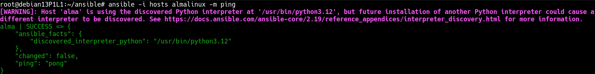

# Bitacora P3L2

## Enunciado

Usted deberá saber cómo instalar y configurar Ansible para poder hacer
un ping a las máquinas virtuales de los servidores y ejecutar un comando básico (p.ej.
el script de monitorización del RAID1). 

También debe ser consciente de la posibilidad de escribir acciones más complejas mediante playbooks escritos con YAML como, por ejemplo, asegurarse de que tenemos la última verisón instalada de httpd y que está en
ejecución.

## Introducción y conceptos

Ansible es una herramienta de administración de máquinas. Donde una máquina de control es capaz de controlar varias a la vez, usando ssh y ficheros. Para acciones más complejas se usan playbooks escritos en YAML, donde se pueden configurar aspectos más complejos.

## Diseño

Primero se instala y configura Ansible en la máquina que hará de nodo de control. Esta máquina podría ser incluso el ordeador personal desde donde se hostean las VM, pero para no complicarlo, se escoge a Debian como máquina de control y Almalinux como la máquina que se monitorea.  

Cuando se compruebe que todo va bien, se pasará a configurar un playbook.

## Implementación del sistema

Lo primero es instalar y configurar Ansible en Debian, se hace desde el gestor de paquetes apt. 

Cuando se haya instalado, hay que verificar que se puede acceder a Almalinux sin contraseña en el puerto correspondiente. Se crea una llave (si no se tiene ya) y se le pasa a la máquina de Almalinux.

```
ssh-keygen -t ed25519 #NO poner contraseña
ssh-copy-id -p 22022 pedrovs@192.168.1.134

#Comprobar acceso sin contraseña (solo la de la llave que se creó)

ssh pedrovs@192.168.1.134 -p 22022
```

Ahora, como Ansible no crea directorios ni archivos de configuración, hay que hacer esto a mano:

```
mkdir -p ~/ansible; cd ~/ansible
```

Dentro del directorio, se crea un archivo de hosts en el que se introduce la información de Alma:

```
vi hosts

[almalinux]
alma ansible_host=192.168.1.134 ansible_port=22022 ansible_user=pedrovs

# [almalinux] : nombre del grupo
# alma : nombre del host
# ansible_host : ip almalinux
# ansible_port : puerto ssh
# ansible_user : usuario remoto
# (opcional) ansible_ssh_private_key_file : directorio de la clave ssh, por si hay más de una
```

Para comprobar la conexión:

```
#Desde /ansible
ansible -i hosts almalinux -m ping

# -i hosts : para que use el archivo
# almalinux : grupo
# -m ping : módulo ping de ansible
```

La salida debería ser:




