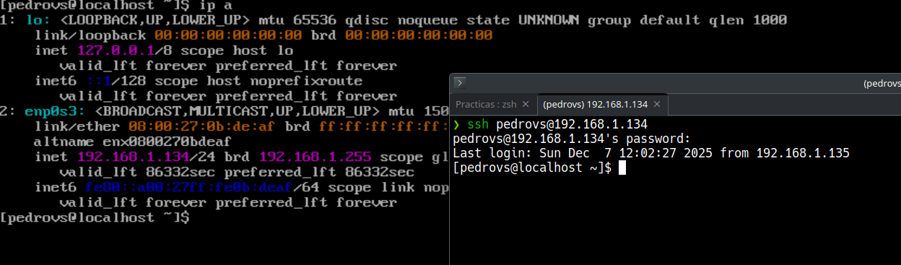

# Bitácora P2L1

## Enunciado: 

Usted está trabajando en una empresa proveedora de servicios y recibe la solicitud de un cliente que desea tener un servidor para la implantación de un comercio electrónico. Una vez diseñado y configurado el almacenamiento, debe enviarle las credenciales de acceso para que el equipo de desarrollo pueda desplegar la aplicación. Dado que FTP no es un protocolo seguro, decide configurar SSH para que el usuario sea capaz de acceder a la consola de manera segura y asegurada (secure and hardened). Para ello, configurará el servicio de modo que el usuario root no pueda tener acceso, que sea posible la autenticación por llave pública, restringirá el usuario que puede acceder acceso y limitará los ataques por fuerza bruta. Además cambiará el puerto por defecto para que no esté en la lista de barrido rápido de nmap.

### Introducción y conceptos

En este ejercicio se debe montar un servicio SSH. Antes de entrar en más detalles sobre el enunciado, se debe definir lo que es SSH y el porqué del protocolo:

- SSH (Secure Shell): un protocolo seguro que proporciona autenticación, encriptación de los datos y control sobre la integridad de los datos que viajan. Es una evolución a protocolos como el FTP que enviaban datos en texto plano, fácilmente vulnerables a ataques de sniffing.

El uso sigue un modelo cliente - servidor, en el que el servidor (lo que se pide configurar), tendrá siempre escuchando un servicio `ssh_d`  (de viene de daemon) y un cliente invocará el servicio ssh para que el servidor le brinde el servicio. Además un servidor puede a su vez ser cliente.

### Diseño

Lo que se hará será configurar los archivos /etc/ssh/sshd_config y el /etc/ssh/ssh_config, para configurar tanto el servicio como el cliente.  

Como máquina se usa una con Almalinux.

### Implementación del sistema

Lo primero es comprobar si se tiene ssh instalado en la máquina, en el caso de Almalinux, sí. Ahora se debe ver si el servicio ssh está activo, para ello se puede usar el comando `ps -Af | grep sshd`, en el caso de esta máquina, sí aparece, esto es un comportamiento deseable. Se puede ahora probar a conectarse al localhost usando `ssh localhost`.

Una vez hecho esto, se creará en el home un directorio .ssh con un archivo know_host, al consultarlo, se puede ver el fingerprint de los host conocidos.

Ahora, se configura el archivo de configuración del servicio, para evitar que el usuario root pueda acceder mediante ssh:

```
sudo vi /etc/ssh/sshd_config
```

Dentro hay que encontrar la opción PermitRootLogin y cambiarla a "no". Posteriormente se reinicia el servicio mediante

```
sudo systemctl restart sshd
```

Ahora se puede comprobar si se puede acceder como root a la máquina haciendo, desde una terminal en nuestro sistema anfitrión:

```
ssh -l root <ip>
```

  


