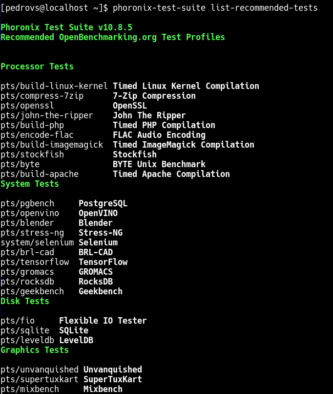
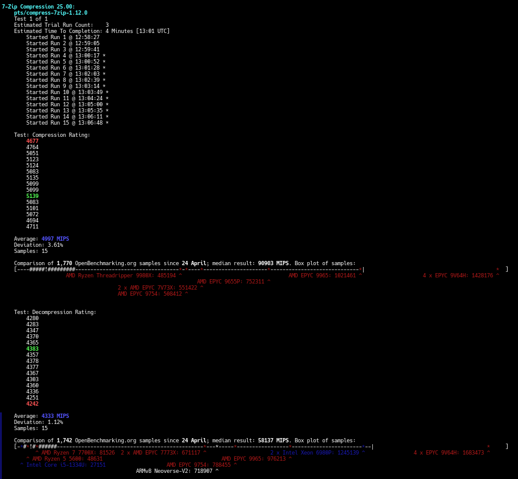
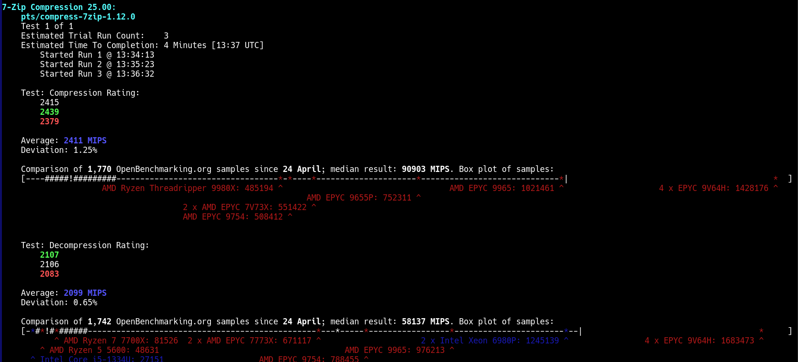
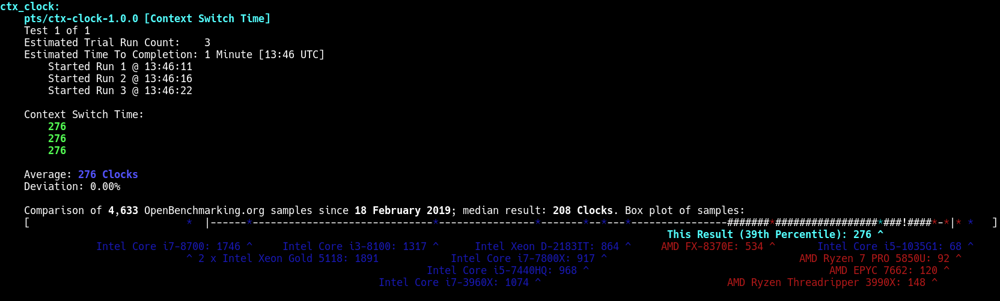
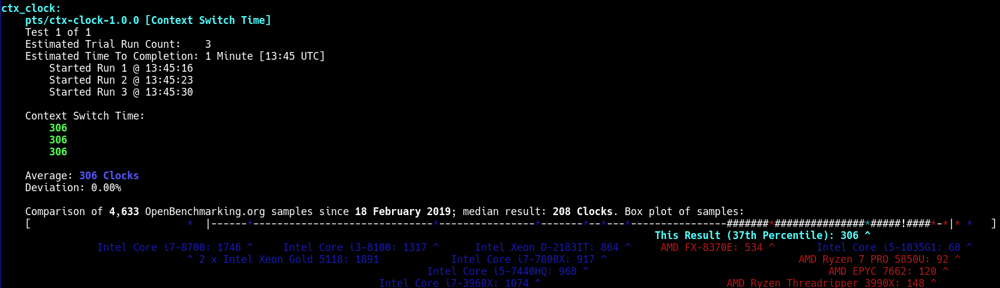

# Bitacora P4L1

## Enunciado

Una vez que haya indagado sobre los benchmarks disponibles, seleccione como mínimo uno de ellos y proceda a ejecutarlos en Debian y Alma Linux. Comente las diferencias de los resultados de ejecución.

## Introducción y conceptos

Este ejercicio se propone en el contexto de Phoronix, la cual es una suite que permite ejecutar un conjunto de benchmarks. 

Un benchmark es un programa que sirve como prueba de rendimiento para una máquina, un componente, un servicio... En definitiva es una prueba usada para la comparación de rendimientos. Es esencial medir las necesidades y objetivos de lanzar un programa de benchmark en un ordenador, teniendo claras cuestiones como las métricas que se usarán, bajo que situación etc.

## Diseño

El ejercicio pide indagar sobre los benchmarks disponibles en Phoronix y seleccionar como mínimo dos, posteriormente ejecutarlos en las máquinas Debian y Almalinux.

Para ver los benchmarks disponibles se puede consultar openbenchmarking.org, también listandolos desde la terminal.

Los test que se eligen son fáciles y rápidos:

1. ctx-clock: microbenchmark de CPU, sirve para comparar eficiencia del kernel y el coste del SO sobre CPU. Además no necesita muchas dependencias
2. 7zip: para compresión y descompresión de archivos

## Implementación del sistema

El primer paso es instalarse la suit en ambos sistemas. Para ello, se clona el repositorio oficial y se ejecuta el script install-sh que incluye.

```
git clone git@github.com:phoronix-test-suite/phoronix-test-suite.git
chmod +x install-sh
sudo ./install-sh

phoronix-test-suite version # Comprobar que todo ok
```

Para mirar los test disponibles

```
phoronix-test-suite list-test
phoronix-test-suite list-recommended-tests # Recomendados para el SO 
```



Ahora, con el comando info, se puede consultar la información de los test listados y en ocasiones, lista lo que le falta para poder hacer esas pruebas. Después de instalar las cosas faltantes:

```
# El de compresión priemero, que es el que hay que instalar dependencias

phoronix-test-suite install pts/compress-7zip # Tarda un ratin
phoronix-test-suite run pts/compress-7zip
```

Los resultados de este benchmarks en ambas distros:

|  |  |
|----------------------|----------------------|

Para el benchmark ctx-clock, mismos comandos, el resultado es:

|  |  |
|----------------------|----------------------|

Comparativa:

En el primer benchmark, el de compresión y descompresión, Debian rinde mucho más en ambos aspectos. Aproximadamente el doble que Almalinux. Las desviaciones en ambos experimeentos son menores al 3%, lo que es un resultado bastante fiable. Esta diferencia se puede achacar a una configuración distinta del kernel o que habían más hilos disponibles en ese momento en Debian. 

De igual forma, según la información de openbenchmarking.org, la mediana global para este test es de 90k MIPS, muy por debajo de los resultados obtenidos. Esto es normal y esperable ya que son máquinas virtuales con unas características muy limitadas.

En el ctx-clock, en el que se miden latencias de cambios de contexto, coste de llamadas al reloj del sistema etc. Debian sigue siendo mejor que Alma, con una diferencia absoluta de 30 ciclos. De nuevo ambos sistemas dan peor resultado que la mediana global, por los motivos antes expuestos 
