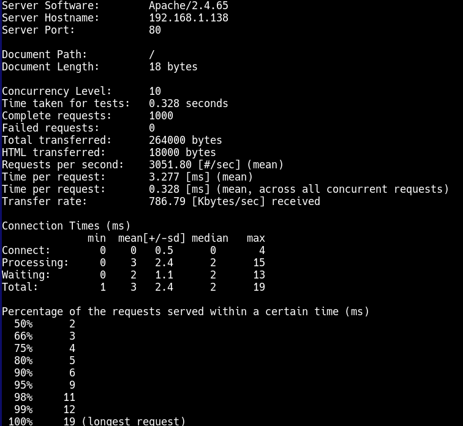
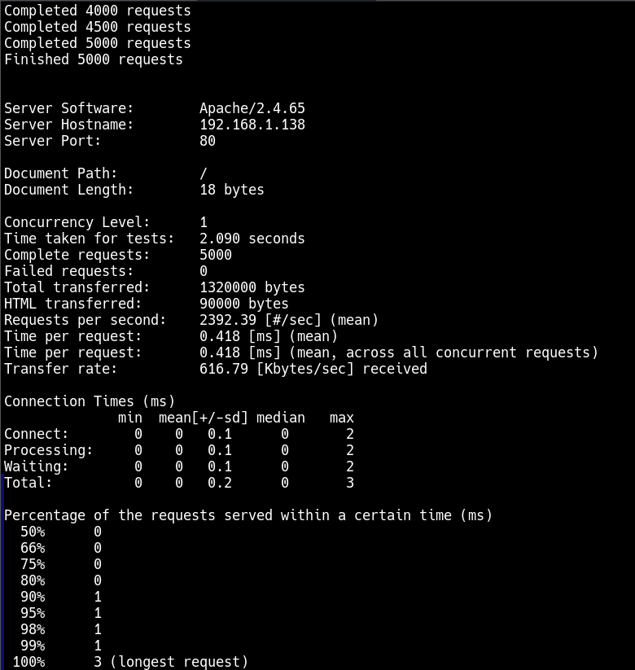
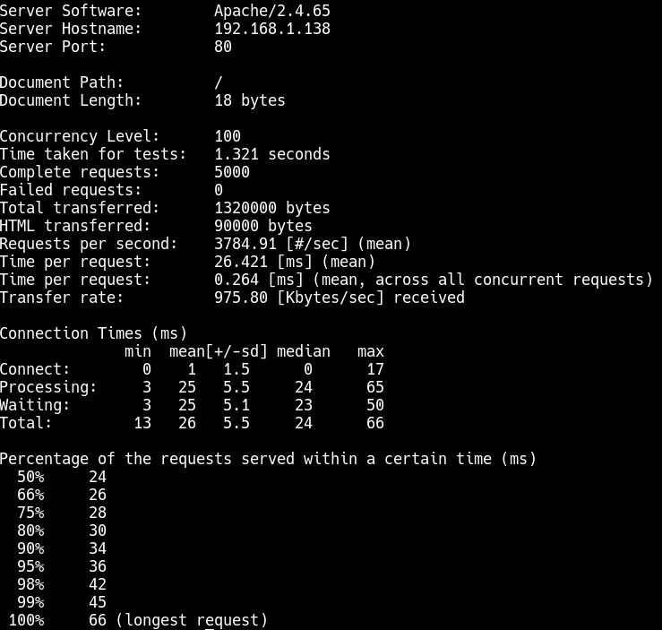
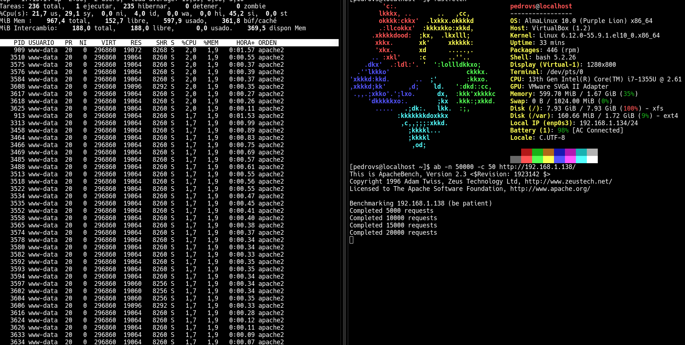

# Bitacora P4L2

## Enunciado

Dentro de los parámetros básicos que usted debe conocer encontramos la opción que especifica la concurrencia así como el número de peticiones. Usted debe probar a ejecutar el benchmark (monitorizar su ejecución en el cliente y en el servidor) con sus máquinas virtuales (Debian y Alma Linux) yobtener conclusiones respecto al tipo de concurrencia que es capaz de generar ab además de comparar resultados.

## Introducción y conceptos 

ab es el comando para Apache Benchmark. Esta prueba está dedicada a servidores web y trata de monitorear parámetros relacionados con las peticiones por segundo que un servidor puede servir

## Diseño

El ejercicio pide ejecutar el benchmark en las dos distribuciones con las que se trabaja. Para ello, antes se debe tener instalado Apache correctamente y funcionando. El benchmark se hará a la página por defecto del localhost. 

En el manual se pueden consultar los switches necesarios para la concurrencia y el número de peticiones. 

## Implementación del sistema

Primero hay que comprobar que el servicio de Apache está instalado y corriendo (explicado en prácticas anteriores). Una vez el servicio está correcto, se puede pasar a la parte de benchmarking.

Primero hay que elegir quien sirve y quien es cliente. Debian hará de servidor y Alma de cliente en este caso.

Desde el cliente se ejecutan:

```
#Prueba base (1000 peticiones y 10 de concurrencia):

ab -n 1000 -c 10 http://192.168.1.138/

#Pruebas para comprobar concurrencia

ab -n 5000 -c 1   http://192.168.1.138/
ab -n 5000 -c 10  http://192.168.1.138/
ab -n 5000 -c 50  http://192.168.1.138/
ab -n 5000 -c 100 http://192.168.1.138/
```

Desde Debian se consulta, mientras esto ocurre, los procesos y envío con top y ss. También se puede consultar en el cliente para ver si ab está saturandolo.

Conclusiones de los test:

NOTA: la concurrencia no es "real" es un número de conexiones simultáneas desde un solo proceso, no hay comportamiento humano. En las fotografías se pueden consultar de estas pruebas más aspectos como el tiempo por conexión, request por segundo en las condiciones del test etc.

1. 1000 peticiones, 10 concurrencias: 0.328 segundos. El server no está saturado, es una carga muy baja
2. 5000 peticiones, 1 concurrencia: 2.09 segundos. Más largo porque son más peticiones y no hay paralelismo. Además el rendimiento (request/s) es menor que el anterior por este motivo. Destacar también que tiempo por petición es mucho menor al anterior.
3. 5000 peticiones, 100 concurrencias: 1.321 segundos. Las peticiones por segundo se mantienen estables con respecto a la primera prueba. Esto demuestra que entre 10 y 100 de concurrencia, está el límite práctico del servidor o cliente en este aspecto. Además la latencia es mucho mayor, consecuencia de aumentar tanto la concurrencia (crece casi linealmente), esto es indicador de que hay colas y esperas.

En resumen, estos datos nos indican que ab es práctico para saber el punto de saturación y medir la capacidad máxima del cliente y el servidor.

Se pueden hacer pruebas más extremas para comprobar los comandos antes mencionados en tiempo real, por ejemplo, enviando 50000 peticiones (hay otras opciones como usar -t para especificar un tiempo de testeo)

Fotografías con los test:

|  |   |
|----------------------|----------------------|

|  |   |
|----------------------|----------------------|
