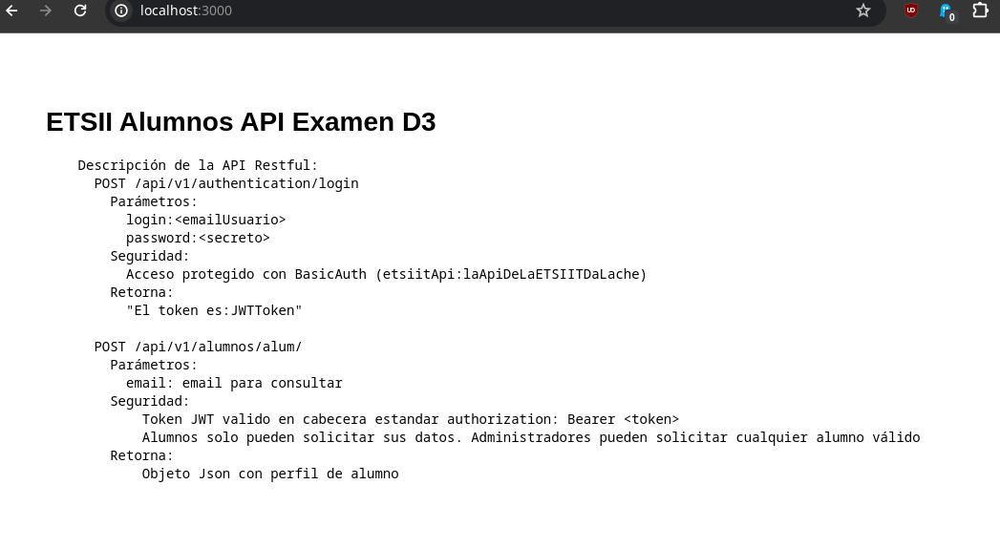
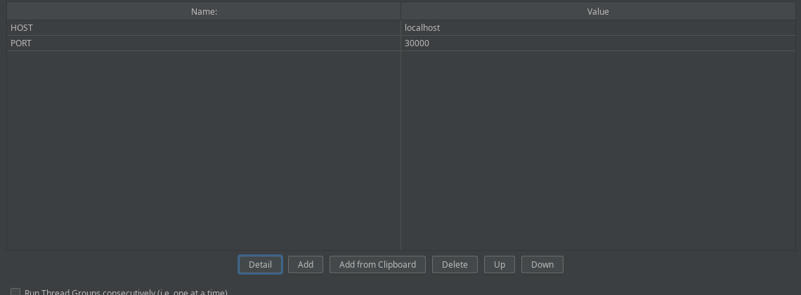

# Bitacora P4L2

## Enunciado

Tras probar un test básico para una web [5], debe ser capaz de generar una carga a una aplicación o CMS. Como ejemplo de práctica utilizaremos Jmeter para hacer un test sobre una aplicación que ejecuta sobre
dos contenedores (uno para la BD y otro para la aplicación en sí). El código está disponible en https://github.com/aguillenATC/ISE-P4App donde se dan detalles sobre cómo ejecutar la aplicación en una de nuestras máquinas virtuales (El repo, contiene una refactorización del un código programado originariamente por David Palomar con una mala praxis en lo que al uso de git se refiere, identifique los errores y aprenda para no repetirlos).

El test de Jmeter debe incluir los siguientes elementos:

El test debe tener parametrizados el Host y el Puerto en el Test Plan (puede
hacer referencia usando $param)

Debe hacer dos grupos de hebras distintos para simular el acceso de los
alumnos y los administradores. Las credenciales de alumno y administrador
se cogen de los archivos: alumnos.csv y administrador.csv respectivamente.
Añadimos esperas aleatorias a cada grupo de hebras (Gaussian Random
Timer)

El login de alumno, su consulta de datos (recuperar datos alumno) y login
del administrador son peticiones HTTP.

El muestreo para simular el acceso de los administradores lo debe coger el
archivo apiAlumnos.log (usando un Acces Log Sampler)

Use una expresión regular (Regular Expressión Extractor) para extraer el
token JWT que hay que añadir a la cabecera de las peticiones (usando
HTTP Header Manager)

## Introducción y conceptos

Este ejercicio pide un refinamiendo del benchmark anterior, incluyendo aspectos más realistas donde hay login, token, cabeceras... 

También hay que usar contenedores, los cuales son similares a las máquinas virtuales, pero ahorrando la función hypervisor.

## Diseño

NOTA: se ha realizado esta práctica en Arch, porque las máquinas virtuales se me han llenado y no quiero perder tiempo agrandando discos

Primero se clonará el repositorio y entrar en Jmeter. Levantarlo con Docker o algún gestor de contenedores.

Después, es necesario comprender el flujo de autenticación, para, por último, construir un plan de pruebas con requisitos concretos.

## Implementación del sistema

Lo primero es clonar el directorio a la máquina virtual. Una vez dentro, se instala Docker para poder levantar los contenedores. La instalación es un poco liosa, pero no complicada si se sigue el manual oficial.

Para levantar: `docker compose up`. Una vez hecho esto y que no se errores, se puede usar `docker compose ps` para comprobar que todo va correcto.

Se comprueba que la API responde en el puerto 3000 haciendo curl o entrando en un navegador.

Según el README del repo, el flujo es el siguiente:

1. /auth/login: se autentica como alumno o admin y si las credenciales son correctas, la API devuelve un JWT (JSON Web Token)
2. /alumnos/alumno: devuelve el expediente de un alumno, para acceder hace falta el token del login

Para comprobar que funciona, se ejecuta el script que incluye el repo, que hace la prueba usando curl. Al hacerlo, devuelve el JSON, por ende este flujo es correcto y funciona bien.

Ahora toca construir esto en JMeter. Primero hay que localizar los archivos con los datos (especificados en el README). Cuando estén localizados, se instala jmeter si no lo está, desde la página oficial o con wget (lo mismo es). Hace falta Java 8 o superior.

Se ejecuta y se trabaja desde interfaz gráfica.

Lo primero es configurar las variables de host (local) y puerto (3000). Para ello Test Plan -> Add. 

