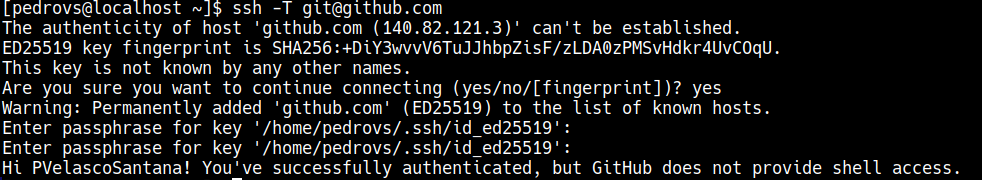
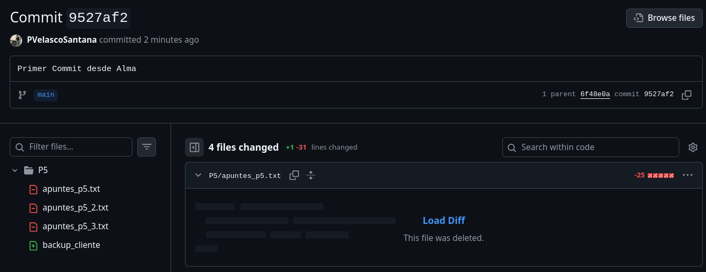
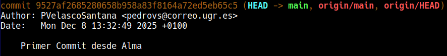

# Bitácora P2L2

## Enunciado

El cliente del comercio electrónico desea implementar una solución de Backup por si el
servidor es vulnerado o por si prefiere cambiar de proveedor de servicios. Sin tener más
información, se negocia que se pondrá disponible una copia del volcado de la BD en
/home/<nombre_usuario/ que estará comprimida junto con el histórico de los comandos
ejecutados por el usuario (~/.bash_history y ~/.mysql_history).

Para ello, creará un script backup_cliente que llamará al comando tar para archivar
esa información y comprimirla. Para el desarrollo del script (python, bash o lo que usted
prefiera) se le requerirá usar Git como control de versiones (puede usar el repo de la
bitácora).

Finalmente, se le solicita que rsync esté disponible para descargar la información así que
usted proporcionará el comando que deben ejecutar para que el archivo se sincronice. Así
que antes de dar comunicar “Hecho” al cliente, lo prueba con un directorio.

## Introducción y conceptos

El concepto novedoso en este ejercicio es el control de versiones con Git.

Este es un software de control de versiones, cuyo propósito principal es llevar registro de los cambios en los archivos. Existen muchas forjas de código que usan Git para subir archivos, descargar... La más conocida es GitHub.

## Diseño

El cliente quiere usar implementar una solución Backup por si vulneran el servidor o decide cambiarse de proveedor. Para ello, se pide guardar:

- Volcado de la BD: debe estar almacenado en un fichero arbitrario (dentro del directorio indicado)
- Historiales de comandos: en los archivos `~/.bash_history` y `~/.mysql_history`

Toda esta información debe quedar en un directorio `/home/<nombre_usuario>` que se comprimirá para que el cliente pueda descargarlo. Se comprime en `.tar`

Para realizar este trabajo se pide un script `backup_cliente` que obtenga toda la información y la comprima. Este script se debe desarrollar usando Git. Idealmente, se usará el repo de las prácticas.

Por último, esta información debe estar disponible para su descarga con `rsync`.

### Implementación del sistema

Lo primero que se debe hacer es configurar Git (info sacada del manual de GitHub). Primero se instala con dnf y se configura el nombre y email:

```
git config --global user.name "PVelascoSantana"
git config --global user.email "pedrovs@correo.ugr.es"
git config --global --list #Para comprobar que es correcto
```

Para configurar el acceso, hay que crear una llave pública con ssh, además, es conveniente agregarle una contraseña

```
ssh-keygen -t ed25519 -C "pedrovs@correo.ugr.es"
```

Se abre el directorio donde esta almacenada, se copia y se añade a GitHub (esto ultimo desde la propia configuración dentro de la web).

Para comprobar que es correcto, se puede hacer:

```
ssh -T git@github.com
```

Y la salida debería ser algo así:

  

Ahora queda clonar el repositorio para poder trabajar y realizar un commit, a ver si todo es correcto:

```
git clone git@github.com:PVelascoSantana/PracticasISE.git
```

En este caso se crea el fichero backup_cliente dentro de la carpeta P5. Se sube usando:

```
git add .; git status; git commit -am "Primer Commit desde Alma"; git status; git push
```

Tanto en la web como en la máquina se puede consultar los cambios y el histórico de commits:

|  |  |
|----------------------|----------------------|

Por último, añadir que hay que tener cuidado a la hora de trabajar de forma simultánea, ya sea con varias máquinas o varias personas, para evitar conflictos. Una buena práctica es siempre hacer `git pull` antes de subir un cambio (en este caso concreto, en el que solo yo estoy trabajando en el repo, pero desde diferentes máquinas a la vez). De nuevo se insta al lector a consultar los manuales de GitHub, ya que son muy prácticos y útiles.

Lo bueno ahora es que se puede trabajar desde la máquina anfitrión, donde se pueden usar editores de texto más "refinados" jjeje viva la informática y los ordenadore

Ahora se configura el script:

Prev: preparar el laboratorio, creando los archivos necesarios. (BD.sql)

Lo primero será realizar el script. Se elige bash para esto. 

El comportamiento del script será el siguiente:

1. Parámetro opcional: al volcado de la BD. Si no se especifica, busca en el $HOME, si no encuentra .sql, da error.
2. El script intenta siempre incluir los ficheros con los historiales
3. El resultado será un .tar en el $HOME con nombre backup_cliente_DDMMYYYY_HHMMSS


